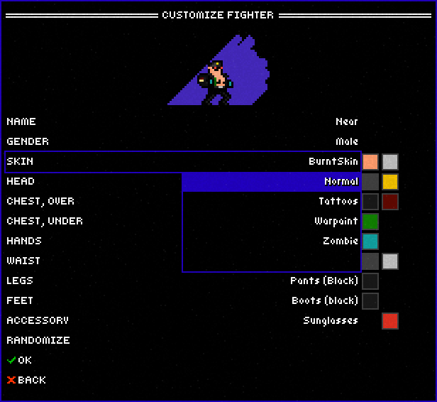
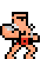
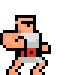

# Cosmetics Internals

## Metadata

- `id`: Has the same value as `fileName`. Female items are suffixed with `_fem`. Note that the game will crash if there are duplicated ids.
- `fileName`: The name without the extension. If it's `SuitJacket.xnb`, the `fileName` is `SuitJacket`.
- `gameName`: The displayed name in game (Suit Jacket).
- `canEquip`: Can the item be changed in the CUSTOMIZE FIGHTER dialog. Example of an un-equippable item: Bear Skin.

    

- `canScript`: Can the item be changed using ScriptAPI. Example of an unscriptable item: Burnt Skin.
- `width`, `height`: The width and height of a tile. The value is always `16`.
- `equipmentLayer`: Determine the order in which the items are drawn on the screen. (`Equipment.cs .GetText()`)
  - `0`: Skin (drawn first, behind other layers)
  - `1`: ChestUnder
  - `2`: Legs
  - `3`: Waist
  - `4`: Feet
  - `5`: ChestOver
  - `6`: Accessory
  - `7`: Hands
  - `8`: Head
  - `9`: Hurt

- `jacketUnderBelt`: Normally this value is `false`. Only some items in ChestOver layer are set to `true`. If so, the ChestOver item is put behind the Waist item:

  | `false`                                         | `true`                                         |
  | ----------------------------------------------- | ---------------------------------------------- |
  |  |  |

- `colorPalette`: The name of the palette that holds a set of colors to customize your clothing. Open `Superfighters Deluxe\Content\Data\Colors\Palettes\ItemPalettes.sfdx` to see more detail. Currently there are 4 palettes in v1.3.7:
  - `Skin`
  - `Clothing1`
  - `ClothingGoggles1`
  - `ClothingDark1`
- `parts`: This is where things get tricky. `parts` is body parts:
  - Type 0: Head
  - Type 1: Body
  - Type 2: Arm
  - Type 3: Fist
  - Type 4: Legs
  - Type 5: Tail

  **Side Note:** The textures in the Tail category are used to animate the part of the coat that covers your ass.

  Each body part contains a list of textures with the name: `{ItemID}_{ItemPartType}_{LocalID}.png` where:
  - `ItemID`: The `id` value in `ItemFile.sfditem`.
  - `ItemPartType`: The index of the body part as described above.
  - `LocalID`: From the ID specified in the [animation config file](https://gist.github.com/NearHuscarl/a1e656640c346aff3bc86bd1e2ff75f0), `LocalID` = `ID` % 50.

  The game need all 3 values above to compute the final z-index for each item in a body part before drawing on the screen.

## Recolor

Clothing uses the same recoloring system as map tiles: same five shade slots, same
marker-pixel substitution, same three levels. `SFD/ItemPart.cs` calls the same
`Textures.RecolorTexture` that tiles use, feeding it the three color names stored for that
equipment layer. Cosmetics are not a special case here.

Each equipment layer independently stores three color names, taken from that item's
`colorPalette`. Those map to the palette's levels, which the script API exposes as:

| Level | Palette key | Script property | Recolors |
| ----- | ----------- | --------------- | -------- |
| 0 | `colors1` | `PrimaryColorPackages` | red marker pixels |
| 1 | `colors2` | `SecondaryColorPackages` | green marker pixels |
| 2 | `colors3` | `TertiaryColorPackages` | blue marker pixels |

Levels are zero-indexed in code (`GetColor1`, `GetColor2`, `GetColor3` and the
`GetFirstColorFromLevel(i)` calls) but one-indexed in the `.sfdx` palette files, hence
the `colors1`/`colors2`/`colors3` naming above.

The color names are shade ramps defined in `Content/Data/Colors/Colors/ItemColors.sfdx`.
An item is only recolorable if its textures contain marker pixels. Of the 213 shipped
`.item` files, 14 contain none and are permanently fixed-color: `BearSkin`, `Burnt`,
`Zombie`, `DogTag`, `Earpiece`, `GoalieMask`, `SantaMask`, `RiceHat`, `GrenadeBelt`,
`HurtLevel1` and `HurtLevel2` (plus the `_fem` variants). No clothing item uses the third
level.

Item textures are stored inside the `.item` binary as palette indices, not loose PNGs, so
that binary is also the only place alpha survives. See
[Colors](../Colors/Colors.md#the-shading-model) for the marker values and
[Color Palettes](../Colors/Palettes.md) for how a palette constrains what the player can
pick.
